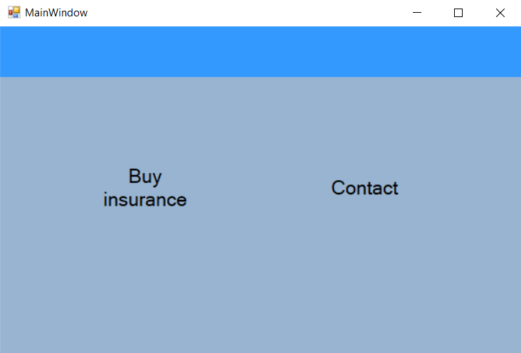
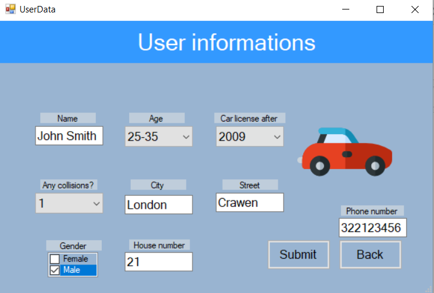
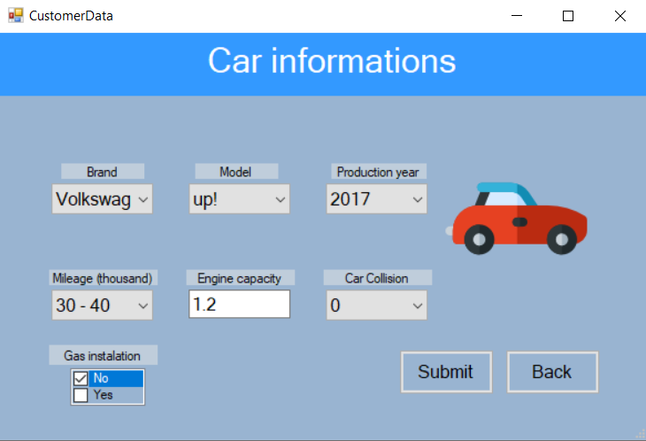
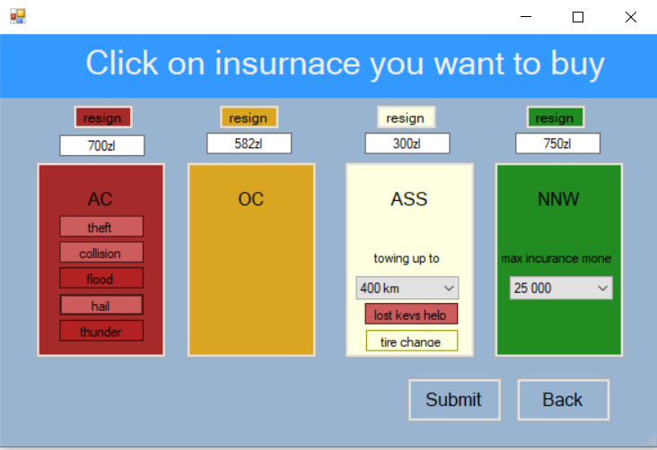
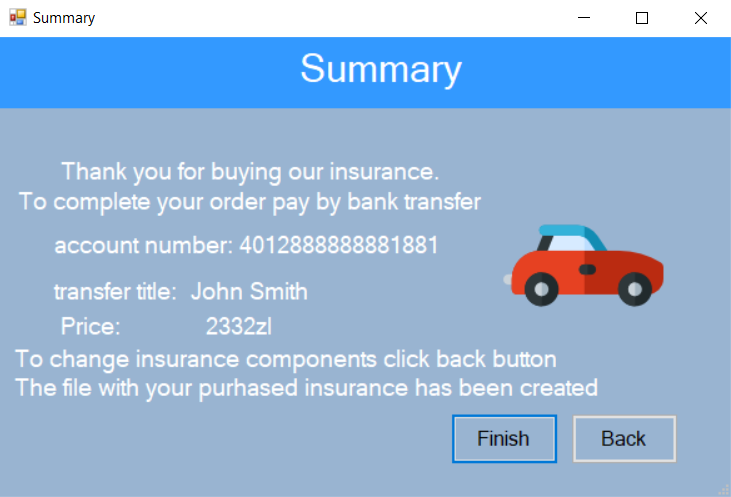

# Car-Insurance-System

Windows Forms
## External specification:
The program consists of 5 stages:
1. Start window - Two options 'Buy insurance' or 'Contact'

  

2. User information - user inserts his data

  

3. Car information - insert information about car

  

4. Choose write insurance by clicking on the right options

  

5. Summary window

  

